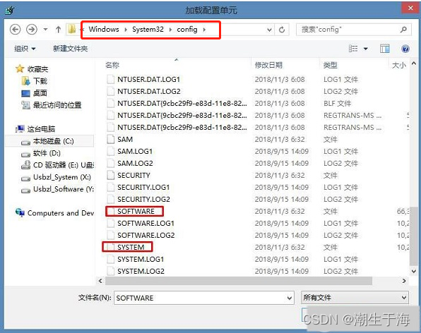
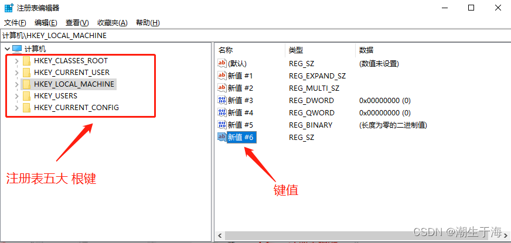
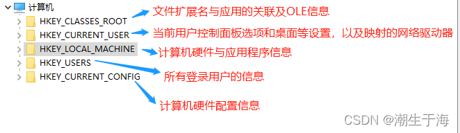

[Windows注册表学习](https://learn.microsoft.com/en-us/previous-versions/windows/it-pro/windows-server-2003/cc778196(v=ws.10))

# 注册表位置

以上红框中标注的就是注册表文件了，但是不能直接打开，只能使用注册表编辑器对这些文件进行操作。切记切记，不要轻易尝试删除注册表文件。

# 注册表结构

**注册表**中，所有的数据都是通过一种树状结构以键和子键的方式组织起来的，就像磁盘文件系统的目录结构一样。

每个键包含一组特定的信息，每个键的键名都是和它所包含的信息相关联的。注册表的根键共有5个，且全为大写。

键值：

键值由三部分组成： 名称、类型、数据。

键值的类型：

键值类型由常用的6种组成

字符串值（REG_SZ）

二进制值（REG_BINARY）

32位值（4个字节）（REG_DWORD）

64位值（5个字节）（REG_QWORD）

多字符串值（REG_MULTI_SZ）

可扩充字符串值（REG_EXPAND_SZ）