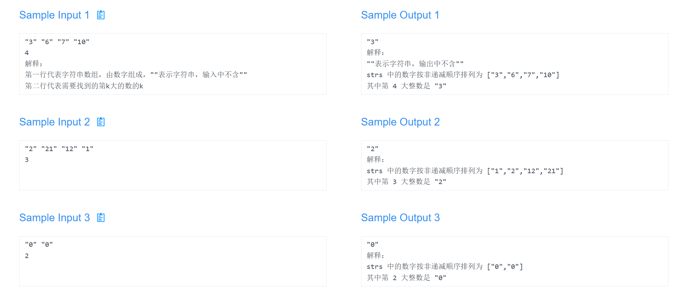

### Description

新学期开学，老师决定按照上学期的评定等级给同学们合理地分配座位，统计出同学们的评定等级存储在字符串数组**strs[]**中，**strs**的每个字符串都表示一个不含前导零的整数。给一个整数**k**，请返回第**k**大整数的字符串，来帮助老师分配座位。

注意：重复的数字在统计时会视为不同元素考虑。例如，如果**strs**是 ["1", "2", "3"]，那么 "2"是最大的数，"2"是第二大的数，"1"是第三大的数。

### Input

第一行输入一个数组，表示学生们的评定等级，第二行输入**k**表示要返回的第**k**大的数。(1≤k≤strs.length≤10000, 1≤strs[i].length≤100)

注意：**strs[i]**仅由数字组成(不含负数)，**strs[i]**不含任何前导零。

### Output

输出第**k**大的数



```java
import java.io.BufferedReader;
import java.io.IOException;
import java.io.InputStreamReader;
import java.util.Arrays;
import java.util.Comparator;

public class Main {
    public static String findStudent(String[] str, int k) {
        Arrays.sort(str, (a, b) -> {
            if (a.length() != b.length()) {
                return b.length() - a.length();
            }
            return b.compareTo(a);
        });

        return str[k - 1];
    }

    public static void main(String[] args) throws IOException {
        BufferedReader reader = new BufferedReader(new InputStreamReader(System.in));
        String[] str = reader.readLine().split(" ");
        int k = Integer.parseInt(reader.readLine());
        
        String result = findStudent(str, k);
        System.out.println(result);
        reader.close();
    }
}
```

