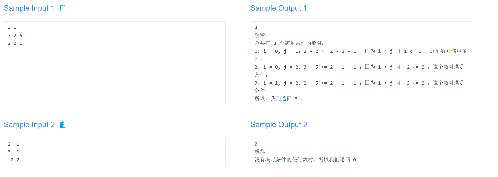

### Description

现在有两个整数**n**和**diff**，有两个长度相同，都为**n**的数组**nums1**和**nums2**，统计满足以下条件的数对**(i, j)**：

- 0 ≤ i < j ≤ n - 1
- nums1[i] -nums1[j]≤nums2[i] -nums2[j] + diff

请返回满足条件的**数对数目**。

### Input

第一行输入整数**n**和**diff**，用空格隔开(2 ≤ n ≤ 100000, -10000≤ diff ≤ 10000)

第二行输入数组**nums1**，长度为**n**，数字之间用空格隔开

第三行输入数组**nums2**，长度为**n**，数字之间用空格隔开(-10000≤ nums1[i], nums2[i] ≤ 10000)

### Output

输出满足条件的数对数目。(用**Long**存储)



```java
import java.util.Scanner;

public class CountPairs {

    public static void main(String[] args) {
        Scanner scanner = new Scanner(System.in);

        int n, diff;
        n = scanner.nextInt();
        diff = scanner.nextInt();

        int[] nums1 = new int[n];
        int[] nums2 = new int[n];

        // 读取数组 nums1
        for (int i = 0; i < n; i++) {
            nums1[i] = scanner.nextInt();
        }

        // 读取数组 nums2
        for (int i = 0; i < n; i++) {
            nums2[i] = scanner.nextInt();
        }

        long count = 0; // 用 long 存储数对数目

        for (int i = 0; i < n; i++) {
            for (int j = i + 1; j < n; j++) {
                if ((long) nums1[i] - nums1[j] <= (long) nums2[i] - nums2[j] + diff) {
                    count++;
                }
            }
        }

        System.out.println(count);
    }
}

```

