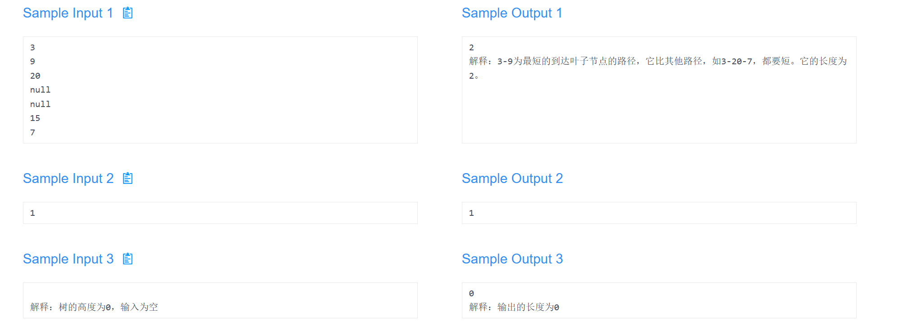

### Description

在一个给定的二叉树中，找出从根节点到离根节点最近的叶子节点的最短路径上经过的节点数量。

需要注意的是，叶子节点指的是没有子节点的节点。

### Input

输入一个代表二叉树的数组，如：

```
3
9
20
null
null
15
7
```

这个数组代表：


当分支节点只有一个孩子时，将这个孩子的兄弟节点设为null；

当叶子节点位于中间层时，需要将它的两个子节点设为null；

当叶子节点位于最底层时，不需要输入它的子节点；

设为null的节点不需要输入它的子节点。

ps.请注意某些语言可能需要区分不同系统的换行符。你需要自己构建一个二叉树，其每个节点存放一个32位int正数。

二叉树高度h : 0 ≤ h≤20

### Output

输出根节点到最近的叶子节点的路径长度



```java
#include <iostream>
#include <algorithm>
#include <sstream>
#include <set>
#include <queue>

using namespace std;

struct treeNode {
    [[maybe_unused]] long int val;
    treeNode *left;
    treeNode *right;

    explicit treeNode(int x) : val(x), left(nullptr), right(nullptr) {}
};

int shortPath(treeNode *root, int path) {
    if (root->left == nullptr && root->right == nullptr)return path;
    else if (root->left != nullptr && root->right == nullptr) {
        return shortPath(root->left, path + 1);
    } else if (root->left == nullptr && root->right != nullptr) {
        return shortPath(root->right, path + 1);
    } else {
        return min(shortPath(root->left, path + 1), shortPath(root->right, path + 1));
    }
}

int main() {
    string str;
    getline(cin, str);
    if (str.empty() || cin.eof()) {
        cout << 0 << endl;
    } else {
        auto root = new treeNode(stol(str));
        treeNode *curNode;
        string str1;
        string str2;
        getline(cin, str1);
        if (str1.empty() || cin.eof()) {
            cout << 1 << endl;
        } else {
            getline(cin, str2);
            queue<treeNode *> node;
            node.push(root);
            while (true) {
                if (str1 == "null" && str2 == "null") {
                    node.pop();
                } else if (str1 != "null" && str2 == "null" ||
                           str1 != "null" && str2.empty()) {
                    curNode = node.front();
                    node.pop();
                    curNode->left = new treeNode(stol(str1));
                    node.push(curNode->left);
                    if (str2.empty())break;
                } else if (str1 == "null" && str2 != "null" ||
                           str1 == "null" && str2.empty()) {
                    if (str2.empty())break;
                    curNode = node.front();
                    node.pop();
                    curNode->right = new treeNode(stol(str2));
                    node.push(curNode->right);
                } else {
                    curNode = node.front();
                    node.pop();
                    curNode->left = new treeNode(stol(str1));
                    curNode->right = new treeNode(stol(str2));
                    node.push(curNode->left);
                    node.push(curNode->right);
                }
                getline(cin, str1);
                if (str1.empty() || cin.eof())break;
                getline(cin, str2);
            }
            int num = shortPath(root, 1);
            cout << num << endl;
        }
    }
}
```

