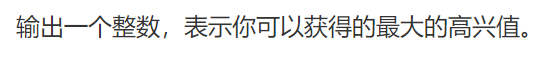

### Description


### Input


### Output



```java
import java.util.Scanner;

public class Main {
    public static void main(String[] args) {
        Scanner scanner = new Scanner(System.in);

        int n = scanner.nextInt();
        int m = scanner.nextInt();

        int[] w = new int[n];
        int[] h = new int[n];

        for (int i = 0; i < n; i++) {
            w[i] = scanner.nextInt();
            h[i] = scanner.nextInt();
        }

        int[] dp = new int[m + 1];
        for (int i = 0; i <= m; i++) {
            dp[i] = 0;
        }

        for (int i = 0; i < n; i++) {
            for (int j = m; j >= w[i]; j--) {
                dp[j] = Math.max(dp[j], dp[j - w[i]] + h[i]);
            }
        }

        System.out.println(dp[m]);
    }
}

```

